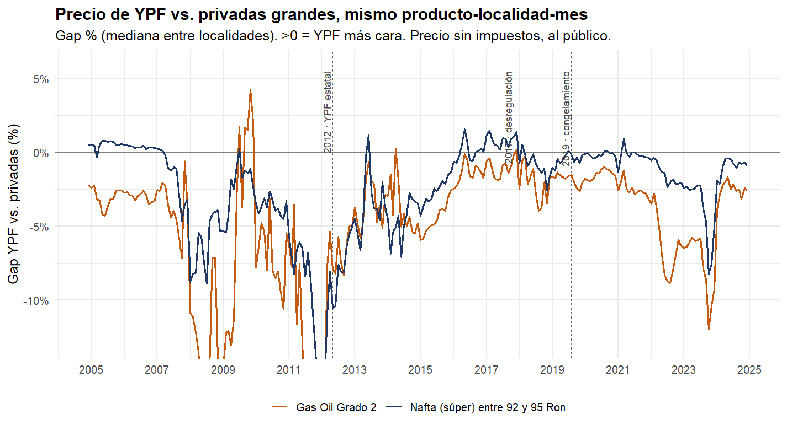
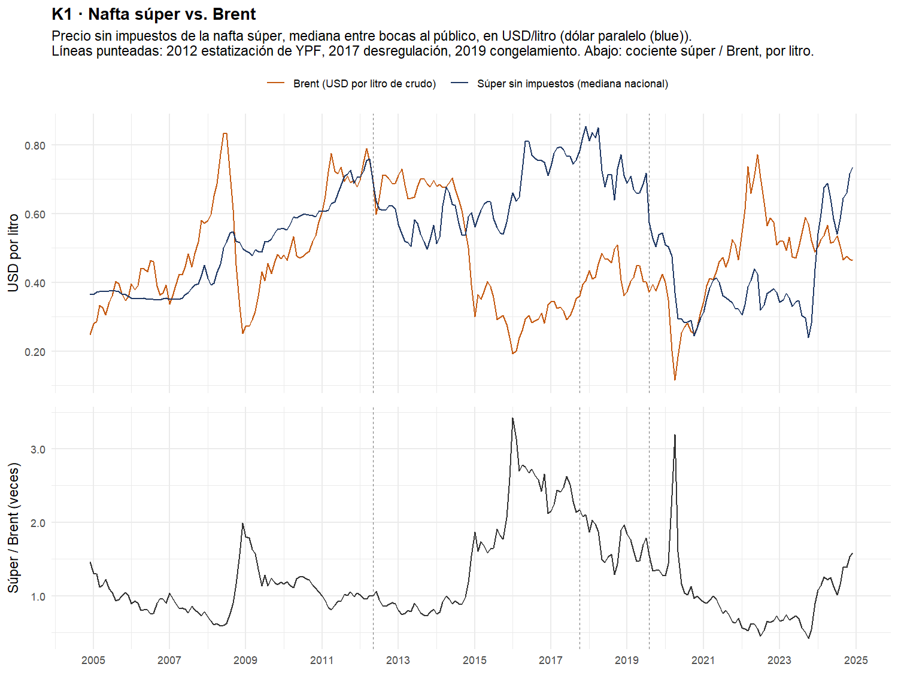

# Retail fuel pricing in Argentina

Code for my M.A. thesis in Economics at Universidad de San Andrés, *When the State Competes: Ownership, Market Power, and Market Failure in Argentina's Retail Gasoline Market* (advisor: M. Florencia Gabrielli). Work in progress.

YPF is the largest fuel retailer in Argentina. It was renationalized in 2012, and governments of different signs have leaned on it to hold pump prices down. The thesis asks how far YPF's prices depart from profit maximization, under which administrations, what that cost the firm in forgone margin, and how much of it reached consumers. I estimate a random-coefficients logit demand for gasoline and diesel and a supply side in which YPF maximizes profit plus a weight λ on consumer surplus, and I compare YPF with private brands that face the same costs in the same markets.

The design is described in [docs/research_proposal.md](docs/research_proposal.md). The choices fixed before estimating the model are recorded in [docs/analysis_plan.md](docs/analysis_plan.md).

This repository contains the data work the estimation builds on: the station-level panel, the geocoding of stations, spatial and market-level covariates, and the descriptive analysis.



*Median gap between YPF and the large private brands for the same product, locality and month (pre-tax price at the pump). Negative values mean YPF is cheaper. Dashed lines mark the 2012 renationalization, the 2017 price deregulation and the 2019 price freeze. Drawn by section 2 of `code/10_descriptives.R` as `fig1_gap_ypf_vs_privadas.png`.*

## Data

The main source is the monthly price and volume report that fuel outlets file with the Secretaría de Energía (Energy Secretariat) under Resolution 1104/2004. The unit of observation is outlet × product × sales channel × month, from December 2004 to December 2024, for the 23 provinces and the City of Buenos Aires: 5.35 million raw records from 9,214 outlets, 8,720 of which are stations that sell to the public. The wholesale dataset generated by the same resolution is used for dispatch plants and wholesale prices.

Volumes are in cubic metres and prices in nominal pesos per litre, both as reported by the outlet; the thresholds in the cleaning scripts are in those units.

The rest comes from public sources: the government's georef API, OpenStreetMap/Nominatim and the kilometre posts of the national highway agency (geocoding); INDEC population projections, the 2022 census and the 2017-18 household expenditure survey; registered wages and employment by department from CEP-XXI and OEDE; the Energy Secretariat's downstream tables (sales by company, refinery runs, fuel imports); Brent and US Gulf Coast gasoline prices from FRED; and the official exchange rate from the Central Bank.

Raw and intermediate files add up to about 10 GB and are not part of the repository. The locality-to-department crosswalk, which was built once and corrected by hand, is in [data/](data/), together with a note on where each external source comes from.

## Repository layout

```
run_all.R                     runs the ten scripts below, in order
code/
  00_config.R                 where the data are
  01_build_panel.R            joins the six raw files
  02_clean_volume.R           parses volume, drops implausible values
  03_clean_prices.R           drops corrupt prices
  04_deduplicate.R            removes duplicate records
  05_business_type.R          infers the type of each outlet
  06_markets.R                locality -> department, the market of the model
  07_geocode_stations.R       coordinates for every outlet
  08_station_variables.R      rivals, distances, highway and border indicators
  09_market_data.R            population, wages, prices and costs by market
  10_descriptives.R           tables and figures
  diagnostics_data_quality.R  how the cleaning thresholds were chosen
data/                         the crosswalk and the geocoding reference tables
docs/
  research_proposal.md
  analysis_plan.md
  figures/
```

Each script reads the file the previous one wrote and saves its own, so the pipeline can be picked up where it stopped instead of rebuilt from the raw files every time.

### 1. Building the panel

| Script | What it does | Saves | Rows after |
|---|---|---|---:|
| `01_build_panel.R` | Joins the six raw files, harmonizes period and variable names | `eess_all_rawbind_2` | 5,346,549 |
| `02_clean_volume.R` | Parses volume, sets implausibly large values to missing, drops records with missing or negligible volume | `eess_all_cleaned3_cut` | 5,289,163 |
| `03_clean_prices.R` | Drops records with extreme pre-tax prices | `eess_all_cleaned4_cut` | 5,287,478 |
| `04_deduplicate.R` | Removes exact duplicates across and within source files | `eess_all_cleaned5_cut` | 5,054,907 |
| `05_business_type.R` | Infers the type of outlet from the products it sells and harmonizes it over time | `eess_all_cleaned7_alternative_sinceappearance` | 5,054,907 |
| `06_markets.R` | Assigns every locality to a department and adds that column to the panel | `..._con_crosswalk` | 5,054,907 |

The files are numbered in the order they are written, and `_cut` marks the steps that drop records rather than only flagging them. Each one is a `.rds` in the interim folder, so the pipeline can restart at any step. The last row is the analysis panel.

Departments are the markets of the demand model: 1,398 localities over 457 departments, with the City of Buenos Aires as a single market. Localities are too fine a unit, since 43.9% of them are served by a single brand; with departments that falls to 17.9%, and the share of stations sitting in a single-brand market goes from 11.5% to 2.0%. The crosswalk is in [data/](data/), so this step runs without calling the API.

`diagnostics_data_quality.R` is the diagnostic pass on volumes and prices behind the thresholds in scripts 2 and 3. It does not modify the panel and `run_all.R` does not call it.

### 2. Geocoding

The source has addresses but no coordinates. `07_geocode_stations.R` runs as a cascade, each section taking on what the previous ones could not place: the georef API and Nominatim on the street address, a structured Nominatim search for the urban addresses that failed, the centroid of the locality for the rest, an audit of the matches that landed in the wrong town because of common street names, kilometre posts for addresses of the form "Ruta 9 km 412", and the coordinates the Energy Secretariat publishes, which fill the stations still without an exact location and leave the audited ones alone.

Every coordinate carries a precision label, and the label is what makes the file usable: 88.6% of stations end up with an exact location, 10.1% with the centroid of their locality, 0.9% with the centroid of their department, and 27 with none. The variables that need real distances, such as nearby rivals, use only the exact ones.

### 3. Station variables

The number of nearby rivals, distance to the nearest refinery and to the refinery and dispatch plant of the station's own brand, distance to the border, a geometric on-highway indicator based on the OSM trunk network, and station amenities. Each script writes its own file and none of them modifies the panel; they are merged in by key when the estimation sample is assembled.

### 4. Market data

Population by department and year (market size), wages and employment by department and month, a consumer price index that chains the San Luis provincial index between December 2005 and November 2016, because the official national index is not reliable over the years INDEC was intervened, Brent, the exchange rate, downstream sales and imports, moments from the household expenditure survey, and an upstream unit cost built in layers (crude, refining, biofuel blending). Most of these parts download their source data and cache it; the Energy Secretariat tables are the exception and have to be there already.

### 5. Descriptives

Market structure and brand shares, the YPF-private price gap, volumes and reporting gaps, station characteristics, and the pump price against crude, US Gulf Coast gasoline and import parity.



*National median pre-tax price of regular gasoline against Brent, both in USD per litre (parallel exchange rate). Bottom panel: ratio of the two. Drawn by section 5 of `code/10_descriptives.R` as `figK1_super_vs_brent.png`.*

## Some things the data required

**Records that share a key are mostly not duplicates.** `04_deduplicate.R` removes only the ones whose substantive values are identical. After that, 65,155 records still share an outlet-product-channel-month key. Working through them (in the thesis, not in this repository) shows that three quarters are pairs of lines for the taxed and the tax-exempt part of the same sale, which the federal fuel tax exemption in Patagonia makes common there; most of the rest are copies from the two source files that overlap in 2013. Only about a fifth are genuinely conflicting reports, almost all diesel in 2009-2011. For the model sample the plan is to collapse each cell to one record, adding volumes and weighting prices by volume.

**The volume tail has two separate causes.** Compressed natural gas carries implausibly large values that no percentile rule handles well, so `02_clean_volume.R` sets floors by product family instead. For gasoline and diesel a tail survives into the descriptives, and looking at it outlet by outlet it is not one problem but two. Thirty-two outlets, 0.4% of the total, report volumes about a thousand times too large in nearly every month they appear: their median outlet-month is 83,630, which divided by a thousand is 84, an ordinary outlet. They look like litres reported where the form asks for cubic metres, and they account for 8.1% of total volume. Another ninety outlets report normal volumes with occasional spikes, which is what a bulk delivery misclassified into the retail channel looks like.

The two need different treatment, since rescaling recovers the first group and only trimming helps with the second. Neither is done in the panel yet. Section 3 of `10_descriptives.R` caps outlet-months at 3,000 m³ for its quantity figures, which brings annual volume of the two focal products to 10-17.5 million m³ against 222 million uncapped, but that cap is descriptive only and drops both groups alike. The rule for the model sample is still open.

**One stretch of the volume cleaning had been lost** and was rewritten from the saved intermediate files. It reproduces them exactly: same rows, columns, total volume and missing values.

## Running the code

The scripts were written in R 4.5 and use `data.table`, `fs`, `readxl`, `openxlsx`, `ggplot2`, `scales`, `knitr`, `sf`, `rnaturalearth`, `jsonlite`, `httr` and `pdftools`.

The scripts look for the data folder on their own (see `code/00_config.R`); on another machine, set `FUEL_DATA_ROOT` to it, for example in `~/.Renviron`. Then, from the repository root, run

```
Rscript run_all.R
```

or the scripts one at a time, in order. Geocoding is slow because Nominatim allows one request per second; set `FUEL_CONTACT_EMAIL` so that those requests identify you, as its usage policy asks.

How far this goes without my working folder: scripts 1 to 6 need only the six raw files, which are public, and rebuild the analysis panel from scratch. Script 7 needs those plus the two reference tables in `data/`, which are included. Scripts 8 to 10 read a handful of tables that were assembled by hand from public sources and are not redistributed here; [data/](data/) lists them and says what each one is for. Two of them have fallbacks that let the script finish with a substituted value instead of stopping, and the substitution is recorded in the output.

Variable names follow the source data and are in Spanish. Comments are in English.

## Status

The panel, the geocoding, the covariates and the descriptive analysis are complete. Demand and supply estimation is in progress and its code will be added as it stabilizes.

## Use

© 2026 María Luján Puchot. All rights reserved. The code is published so that it can be read, not reused: please write to me before using any part of it. The files under `data/` that come from public sources keep the licenses of their own publishers, which `data/README.md` records.

María Luján Puchot, Universidad de San Andrés
