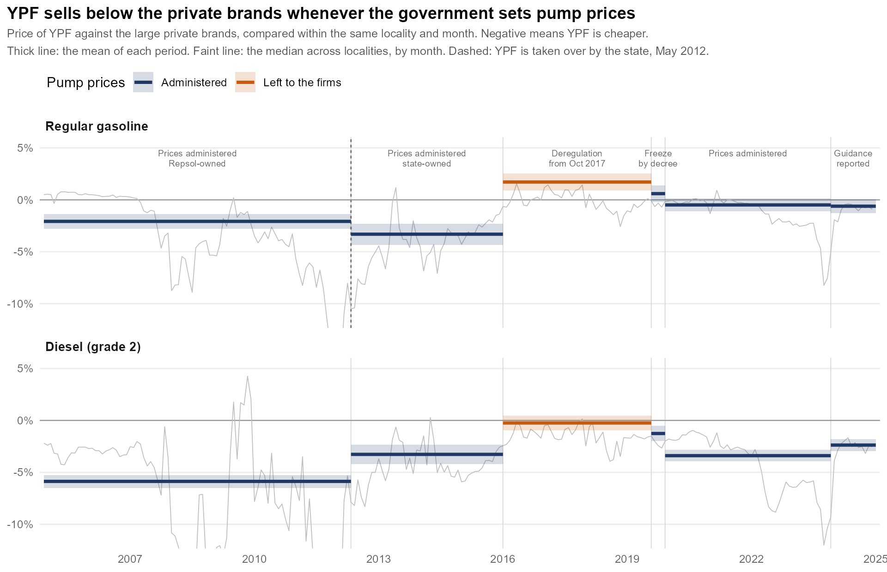

# Retail fuel pricing in Argentina

Code for my M.A. thesis in Economics at Universidad de San Andrés, *When the State Competes: Ownership, Market Power, and Market Failure in Argentina's Retail Gasoline Market* (advisor: M. Florencia Gabrielli). Work in progress.

YPF is the largest fuel retailer in Argentina. It was renationalized in 2012, and governments of different signs have leaned on it to hold pump prices down. The thesis asks how far YPF's prices depart from profit maximization, under which administrations, what that cost the firm in forgone margin, and how much of it reached consumers. I estimate a random-coefficients logit demand for gasoline and diesel and a supply side in which YPF maximizes profit plus a weight λ on consumer surplus, and I compare YPF with private brands that face the same costs in the same markets.

The design is described in [docs/research_proposal.md](docs/research_proposal.md). The choices fixed before estimating the model are recorded in [docs/analysis_plan.md](docs/analysis_plan.md), and what is still undecided about the data, with the evidence and the rule I am considering for each, in [docs/open_issues.md](docs/open_issues.md) and in the [open issues](https://github.com/Lujanpuchot/fuel-pricing-argentina/issues).

This repository contains the data work the estimation builds on: the station-level panel, the geocoding of stations, spatial and market-level covariates, and the descriptive analysis.



*Price of YPF against the large private brands, compared within the same locality and month, so the gap is not driven by where each brand sits. The thick line is the mean of each period; the faint one is the median across localities, month by month. Periods are labelled by what the government did with pump prices, and coloured by whether it set them: the one period it did not is the only one in which YPF does not sell below the private brands. Ownership and policy cannot be separated here, since YPF was privately owned only in years when prices were also being negotiated with the government, which is why the thesis identifies the weight on consumer surplus from the pricing conditions rather than from this comparison. Deregulation is dated from October 2017 and the block still contains the freeze agreed in May 2018. The unbranded outlets, not drawn, sit above the large private brands in every period, by 0.6 to 4 percent. Drawn by `code/figure_readme.R`.*

## Why this case

Governments own firms that compete with private ones in fuel, electricity, banking and air travel across much of the world, and the standard defence of that ownership is that a state firm disciplines the market from inside. The claim is easy to make and hard to check, because it needs the firm's objective, and the objective is what economists usually assume rather than measure. The empirical literature has mostly looked at public monopolies, or at a public option entering a market, where the comparison with a private firm in the same conditions is not available.

Argentina's retail fuel market offers that comparison. YPF sells a little over half the gasoline and diesel bought at the pump and competes product by product, street by street, with Shell, Axion and Puma under the same costs and the same taxes. It was privately controlled until 2012 and state-controlled after, inside a single panel, and prices were administered in some years and free in others. The same firm, the same markets, ownership and regulation moving on different dates: enough to ask whether the firm prices differently because of who owns it, and how much that is worth to the people who buy from it.

Ownership and the pricing regime changed on different dates, which is what lets them be told apart. Prices were administered both while Repsol controlled YPF and after the state took it over in 2012, so ownership moves with the regime held fixed; the state kept the company through the deregulation of 2017-2019, so the regime moves with ownership held fixed. The case the period does not contain is a privately controlled YPF facing free prices. Three of the four cells are observed and the fourth is not, which is why the front-page figure is read as a description and not as an identification.

## What the thesis answers

One parameter carries all of it. Write YPF's objective as profit plus $\lambda$ times consumer surplus; its margin is then $(1-\lambda)$ times the margin a pure profit maximizer would charge with the same demand and the same cost. Five questions follow, and the thesis is the attempt to answer them:

1. **Does YPF give up margin, and how much?** Private brands in the same markets are the benchmark, and also the placebo: their weight should be zero.
2. **Is it the government or is it ownership?** $\lambda$ is estimated for each administration, and the two changed on different dates.
3. **Where does it happen?** Departments where YPF is the only brand, against those where it competes.
4. **Through which channel?** The pump price at the stations YPF prices itself, or the wholesale price charged to the dealers who price their own.
5. **What is it worth, and to whom?** The margin given up and the part of it that reaches consumers, in pesos per litre, against a counterfactual in which YPF maximizes profit and the private brands re-optimize.

## What it does not answer

Regulation enters as context: it defines the periods and is described, not given a parameter of its own. Whether state control and price regulation are substitutes or complements therefore stays open, and so does the wholesale bargaining the design once had. Both are filed as [issues](https://github.com/Lujanpuchot/fuel-pricing-argentina/issues) rather than promised here.

A fourth piece did not survive contact with the data. The design also had the discount negotiated between YPF and its dealers and split along the chain with a Nash-in-Nash bargaining model. Its prediction failed before anything was estimated: the wholesale gap between YPF and the private brands is widest under regulation, about 5 percent, and narrows to about 2 percent in the windows when prices were free, which is the reverse of what the model implied. No bargaining model is estimated. What is left of it is a descriptive decomposition of where YPF's discount sits in the chain, and the contract rules that say whose pricing condition applies to each station.

## What the thesis adds

Three things, and the third is the point. The weight λ is estimated rather than assumed or tested on a grid, and estimated separately for each government, so "was the company used to hold prices down" becomes a number per administration with a band around it. Cost is measured outside the model, in layers, because recovering it by inverting the pricing condition would drive λ to zero by construction. And the estimates end in pesos per litre: how much margin YPF gave up, and how much of it reached consumers once the private brands are allowed to re-optimize against a YPF that no longer holds its price down.

## Where YPF is the only brand

A second question the panel answers without a model: what does a brand do where it has no rival? Single-brand departments are common in the periphery, and most of them are YPF's. In 2024, 82 of the 441 departments with an outlet were served by one brand and 55 of those were YPF's; the proportion barely moves over the period, staying between 64 and 70 percent in every year.

Take each outlet's pre-tax price as a deviation from the average of its province and product, and compare, for one brand, the departments where it competes with those where it is the only one. The difference is what that brand charges for being alone.

| 2024 | Competing | Alone | Premium |
|---|---:|---:|---:|
| Large private brands | +1.0% | +5.3% | **+4.3 pp** |
| YPF | -0.2% | -0.2% | **-0.0 pp** |

In 2024 a large private brand alone in its market charges 5.3% above its province, 4.3 points more than where it faces rivals. YPF charges what it charges anywhere else.

One year is not the rule, and the twenty of them split into a robust part and a fragile one. The robust part is YPF: its premium stays flat around zero every year of the period, between -2.8 and +1.6 points and averaging +0.2, measured over 100 to 140 departments a year, and it does so under Repsol as much as under the state. Where YPF is alone, it does not price as a monopolist.

The fragile part is the size of the private premium. It swings: +6 points in 2008-10, -6 in 2017, when deregulated private brands charged *less* where they were alone, +7 in 2022, +5 in 2024. It rests on 8 to 24 departments a year, and that scarcity is itself the finding, because the captive periphery is mostly YPF's. Pooled over 2005-2024 the difference between the two brands is 0.9 points and not significant (t = 0.76), so the 4.3 of 2024 is a peak of that series rather than its level.

This is the descriptive side of what the model is for. A flat monopoly premium is consistent with a firm that puts weight on consumer surplus, but it is also consistent with a firm that prices near-uniformly across the country for reasons of its own, as retail chains often do. Telling the two apart needs the demand system, which is why the captive-versus-competitive contrast is a secondary result in the [analysis plan](docs/analysis_plan.md) and carries a band. The figures behind these numbers are in the thesis, not in this repository.

## Data

The main source is the monthly price and volume report that fuel outlets file with the Secretaría de Energía (Energy Secretariat) under Resolution 1104/2004. The unit of observation is outlet × product × sales channel × month, from December 2004 to December 2024, for the 23 provinces and the City of Buenos Aires: 5.35 million raw records from 9,214 outlets, 8,720 of which are stations that sell to the public. The wholesale dataset generated by the same resolution is used for dispatch plants and wholesale prices.

Volumes are in cubic metres and prices in nominal pesos per litre, both as reported by the outlet; the thresholds in the cleaning scripts are in those units.

The rest comes from public sources: the government's georef API, OpenStreetMap/Nominatim and the kilometre posts of the national highway agency (geocoding); INDEC population projections, the 2022 census and the 2017-18 household expenditure survey; registered wages and employment by department from CEP-XXI and OEDE; the Energy Secretariat's downstream tables (sales by company, refinery runs, fuel imports); Brent and US Gulf Coast gasoline prices from FRED; and the official exchange rate from the Central Bank.

Raw and intermediate files add up to about 10 GB and are not part of the repository. The locality-to-department crosswalk, which was built once and corrected by hand, is in [data/](data/), together with a note on where each external source comes from.

## Repository layout

```
run_all.R                     runs the numbered R scripts below, in order
code/
  00_config.R                 where the data are
  01_build_panel.R            joins the six raw files
  02_clean_volume.R           parses volume, drops implausible values
  03_clean_prices.R           drops corrupt prices
  04_deduplicate.R            removes duplicate records
  05_business_type.R          infers the type of each outlet
  06_markets.R                locality -> department, the market of the model
  07_geocode_stations.R       coordinates for every outlet
  08_station_variables.R      rivals, distances, highway and border indicators
  09_market_data.R            population, wages, prices and costs by market
  10_descriptives.R           tables and figures
  11_demand_sample.R          the product-market file the demand model needs
  12_estimation_sample.R      joins the market and station variables onto it
  13_estimation.py            demand in PyBLP, and the markups the supply step needs
  figure_readme.R             the figures on the front page, in English
  diagnostics_data_quality.R  how the cleaning thresholds were chosen
data/                         the crosswalk, the geocoding reference tables and the 20-F extract
docs/
  research_proposal.md
  analysis_plan.md
  open_issues.md
  figures/
```

Each script reads the file the previous one wrote and saves its own, so the pipeline can be picked up where it stopped instead of rebuilt from the raw files every time.

### 1. Building the panel — `01_build_panel.R` to `06_markets.R`

| Script | What it does | Saves | Rows after |
|---|---|---|---:|
| `01_build_panel.R` | Joins the six raw files, harmonizes period and variable names | `eess_all_rawbind_2` | 5,346,549 |
| `02_clean_volume.R` | Parses volume, sets implausibly large values to missing, drops records with missing or negligible volume | `eess_all_cleaned3_cut` | 5,289,163 |
| `03_clean_prices.R` | Drops records with extreme pre-tax prices | `eess_all_cleaned4_cut` | 5,287,478 |
| `04_deduplicate.R` | Removes exact duplicates across and within source files | `eess_all_cleaned5_cut` | 5,054,907 |
| `05_business_type.R` | Infers the type of outlet from the products it sells and harmonizes it over time | `eess_all_cleaned7_alternative_sinceappearance` | 5,054,907 |
| `06_markets.R` | Assigns every locality to a department and adds that column to the panel | `..._con_crosswalk` | 5,054,907 |

The files are numbered in the order they are written, and `_cut` marks the steps that drop records rather than only flagging them. Each one is a `.rds` in the interim folder, so the pipeline can restart at any step. The last row is the analysis panel.

Departments are the markets of the demand model: 1,398 localities over 457 departments, with the City of Buenos Aires as a single market. Localities are too fine a unit, since 43.9% of them are served by a single brand; with departments that falls to 17.9%, and the share of stations sitting in a single-brand market goes from 11.5% to 2.0%. The crosswalk is in [data/](data/), so this step runs without calling the API.

`diagnostics_data_quality.R` is the diagnostic pass on volumes and prices behind the thresholds in scripts 2 and 3. It does not modify the panel and `run_all.R` does not call it.

### 2. Geocoding — `07_geocode_stations.R`

The source has addresses but no coordinates. `07_geocode_stations.R` runs as a cascade, each section taking on what the previous ones could not place: the georef API and Nominatim on the street address, a structured Nominatim search for the urban addresses that failed, the centroid of the locality for the rest, an audit of the matches that landed in the wrong town because of common street names, kilometre posts for addresses of the form "Ruta 9 km 412", and the coordinates the Energy Secretariat publishes, which fill the stations still without an exact location and leave the audited ones alone.

Every coordinate carries a precision label, and the label is what makes the file usable: 88.6% of stations end up with an exact location, 10.1% with the centroid of their locality, 0.9% with the centroid of their department, and 27 with none. The variables that need real distances, such as nearby rivals, use only the exact ones.

### 3. Station variables — `08_station_variables.R`

The number of nearby rivals, distance to the nearest refinery and to the refinery and dispatch plant of the station's own brand, distance to the border, a geometric on-highway indicator based on the OSM trunk network, and station amenities. Each section writes its own file and none of them modifies the panel; they are merged in by key when the estimation sample is assembled.

### 4. Market data — `09_market_data.R`

Population by department and year (market size), wages and employment by department and month, a consumer price index that chains the San Luis provincial index between December 2005 and November 2016, because the official national index is not reliable over the years INDEC was intervened, Brent, the exchange rate, downstream sales and imports, moments from the household expenditure survey, and an upstream unit cost built in layers (crude, refining, biofuel blending). Most of these parts download their source data and cache it; the Energy Secretariat tables are the exception and have to be there already.

### 5. Descriptives — `10_descriptives.R`

Market structure and brand shares, the YPF-private price gap, volumes and reporting gaps, station characteristics, and the pump price against crude, US Gulf Coast gasoline and import parity. Its fifth section writes the series behind the last of these, which `figure_readme.R` draws as `docs/figures/pump_price_vs_brent.png`: it puts the pump price next to the international benchmark, which is worth having in the thesis as context but reads as a margin when it is not one, since YPF refines domestic crude that was priced well below Brent in several of these years.

## Some things the data required

**Records that share a key are mostly not duplicates.** `04_deduplicate.R` removes only the ones whose substantive values are identical. After that, 65,155 records still share an outlet-product-channel-month key. Working through them (in the thesis, not in this repository) shows that three quarters are pairs of lines for the taxed and the tax-exempt part of the same sale, which the federal fuel tax exemption in Patagonia makes common there; most of the rest are copies from the two source files that overlap in 2013. Only about a fifth are genuinely conflicting reports, almost all diesel in 2009-2011. For the model sample the plan is to collapse each cell to one record, adding volumes and weighting prices by volume.

**The volume tail has two separate causes.** Compressed natural gas carries implausibly large values that no percentile rule handles well, so `02_clean_volume.R` sets floors by product family instead. For gasoline and diesel a tail survives into the descriptives, and looking at it outlet by outlet it is not one problem but two. Thirty-two outlets, 0.4% of the total, report volumes about a thousand times too large in nearly every month they appear: their median outlet-month is 83,630, which divided by a thousand is 84, an ordinary outlet. They look like litres reported where the form asks for cubic metres, and they account for 8.1% of total volume. Another ninety outlets report normal volumes with occasional spikes, which is what a bulk delivery misclassified into the retail channel looks like.

The two need different treatment, since rescaling recovers the first group and only trimming helps with the second. Neither is done in the panel yet. Section 3 of `10_descriptives.R` caps outlet-months at 3,000 m³ for its quantity figures, which brings annual volume of the two focal products to 10-17.5 million m³ against 222 million uncapped, but that cap is descriptive only and drops both groups alike. The rule for the model sample is still open; the candidates are in [docs/open_issues.md](docs/open_issues.md).

**One stretch of the volume cleaning had been lost** and was rewritten from the saved intermediate files. It reproduces them exactly: same rows, columns, total volume and missing values.

## Running the code

The scripts were written in R 4.5 and use `data.table`, `fs`, `readxl`, `openxlsx`, `ggplot2`, `scales`, `knitr`, `sf`, `rnaturalearth`, `jsonlite`, `httr` and `pdftools`.

The scripts look for the data folder on their own (see `code/00_config.R`); on another machine, set `FUEL_DATA_ROOT` to it, for example in `~/.Renviron`. Then, from the repository root, run

```
Rscript run_all.R
```

or the scripts one at a time, in order. Geocoding is slow because Nominatim allows one request per second; set `FUEL_CONTACT_EMAIL` so that those requests identify you, as its usage policy asks.

How far this goes without my working folder: scripts 1 to 6 need only the six raw files, which are public, and rebuild the analysis panel from scratch. Script 7 needs those plus the two reference tables in `data/`, which are included. Scripts 8 to 10 read a handful of tables that were assembled by hand from public sources and are not redistributed here; [data/](data/) lists them and says what each one is for. Two of them have fallbacks that let the script finish with a substituted value instead of stopping, and the substitution is recorded in the output.

Variable names follow the source data and are in Spanish. Comments are in English.

## Status

The panel, the geocoding, the market covariates and the descriptive and event evidence are done, and this repository is that work. The estimation sample is done too: `11_demand_sample.R` assembles the product-market file and `12_estimation_sample.R` joins the market and station variables onto it, 222,147 products over 35,481 markets.

Demand is what I am writing now. `13_estimation.py` is the specification, the instruments and the markups the supply side needs, and it has not been run on the full sample yet. Two things in it are open and are marked in the code. The price instrument is a refinery supply shock whose weights are not built, and without it the price coefficient leans on the differentiation instruments, which identify substitution better than they identify the level of the price response. And the cost of a litre to YPF is not observed, because a transfer price inside an integrated firm is an accounting entry rather than a market price, so the weight on consumer surplus is bounded before it is estimated: the code says how the bound is built and what would turn it into a point.

Six decisions about the data are still open and are listed in [docs/open_issues.md](docs/open_issues.md), with the evidence behind each one. The one that blocks the quantity side is the group of outlets that report volume in litres.

## Use

© 2026 María Luján Puchot. All rights reserved. The code is published so that it can be read, not reused: please write to me before using any part of it. The files under `data/` that come from public sources keep the licenses of their own publishers, which `data/README.md` records.

María Luján Puchot, Universidad de San Andrés
